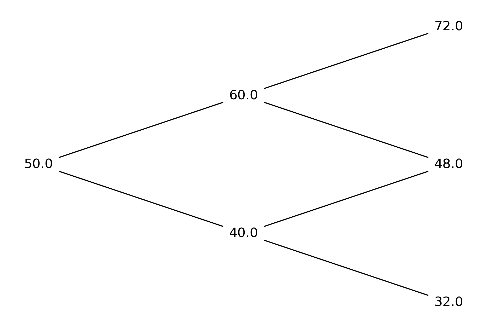
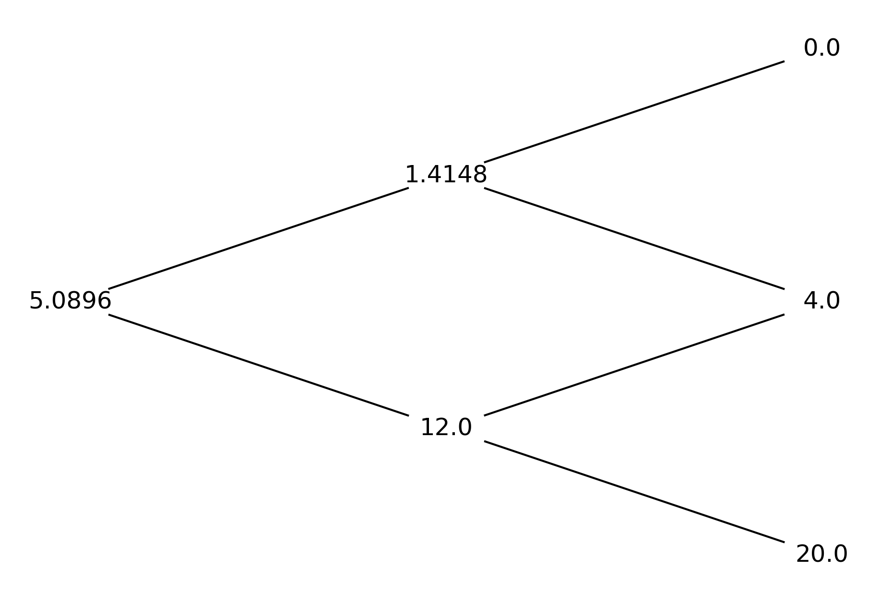

# Binomial_Option_Pricing
## Purpose
This repo computes American and European option value using binomial approach and draws binomial trees.

## Usage
First, you can enter your own inputs by changing the given inputs in the programme, which is under the line:
`if __name__ == '__main__':`

The "opt_type" input only accepts one of the following: "American_call", "American_put", "Euro_call" and "Euro_put"
Run the model then you will get the current value of the option.

A price tree of the underlying asset will be plotted like this:

The option value at each node will look like this:

## References
http://janroman.dhis.org/stud/I2014/CRR/CRR.py
https://github.com/saulwiggin/finance-with-python/blob/master/p4f.py

